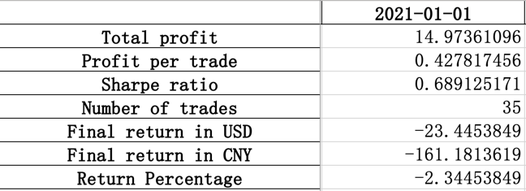
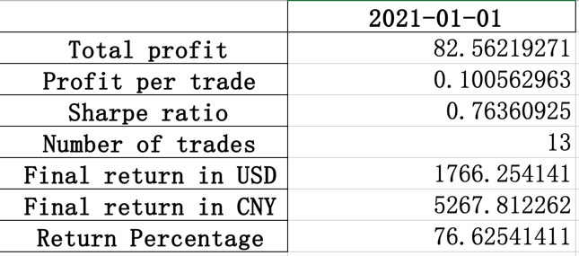
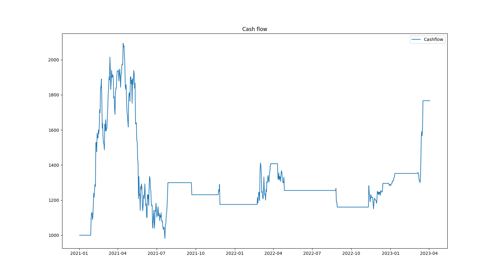
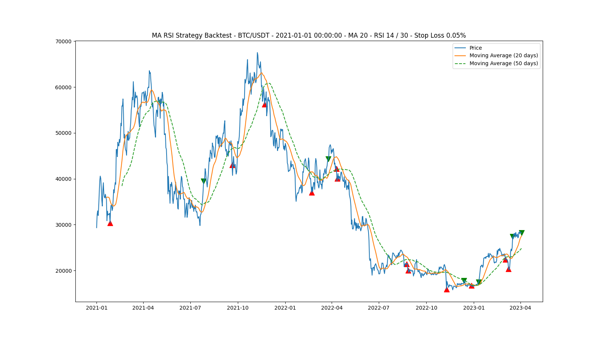

# Cryto
Simple cryto trading strategy by using RSI and short term moving average (20days), long term moving average(50days).

### Start:
The first strategy is simple use the whole dataset (i.e from the start date to today) to 
calculate rsi and moving average.

but the results is not that great, lose about 2% cash.

So according to my observation, the strategy tends to have a better results when the dataset is small. Thus, I use the sixty day rolling dataset to implement a better strategy.

### New strategy:
The same as before, we start to trade in 2021-01-01 and here is the result:

Wow! the strategy becomes 76% in return from -2%.
Here are more relevant graphs (buy and sell signals are in Chinese convention, red for buying and green for selling):

